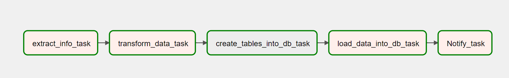
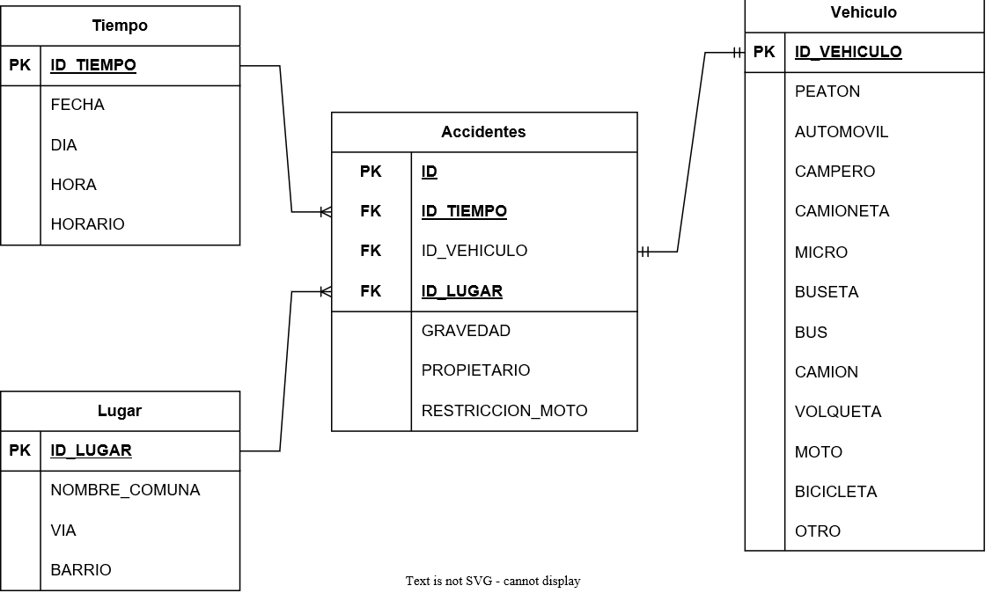
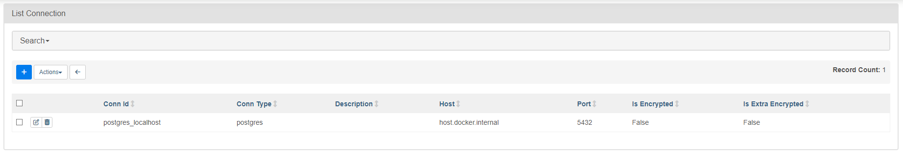
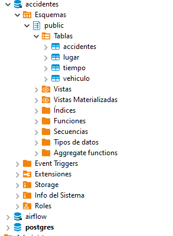
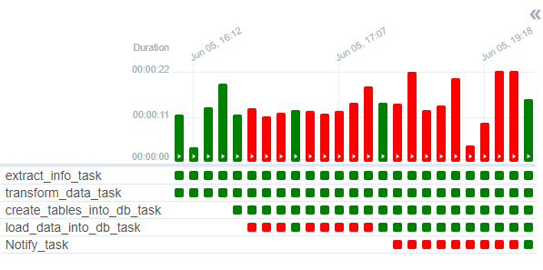

# Prueba Foodology

Se realiza un ETL de la [API del Gobierno](https-datos.gov.co/resource/7cci-nqqb.json) para cargar los datos en una base de datos.

## Extract

Hago una petición a la api, formateo los datos y los guardo en local en formato csv para posteriormente transformarlos.

## Transform

Con la libreria pandas leo el csv que acabe de crear y transformo los datos para dejarlos en formato csv de nuevo.

De los datos que obtego, creo 3 tablas de dimensiones y una tabla de hechos

## Load

Creo una conexion al gestor en donde esta corriendo Airflow para poder crear una base y posteriormente las tablas.

Usando DBeaver puedo visualizar los resultados.

Despues de muchos problemas, obtenemos el DAG funcional

